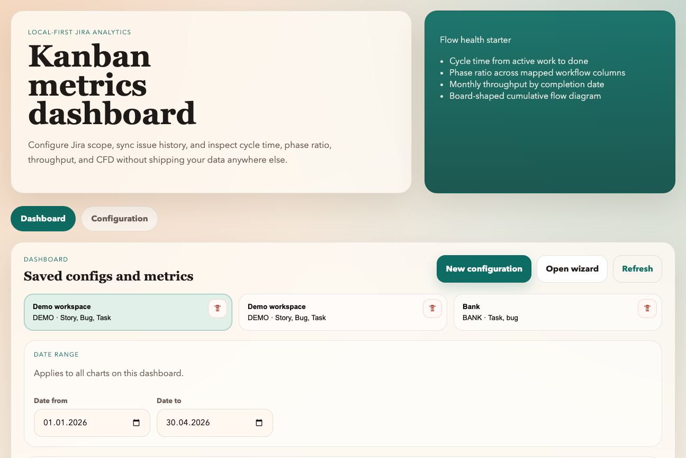
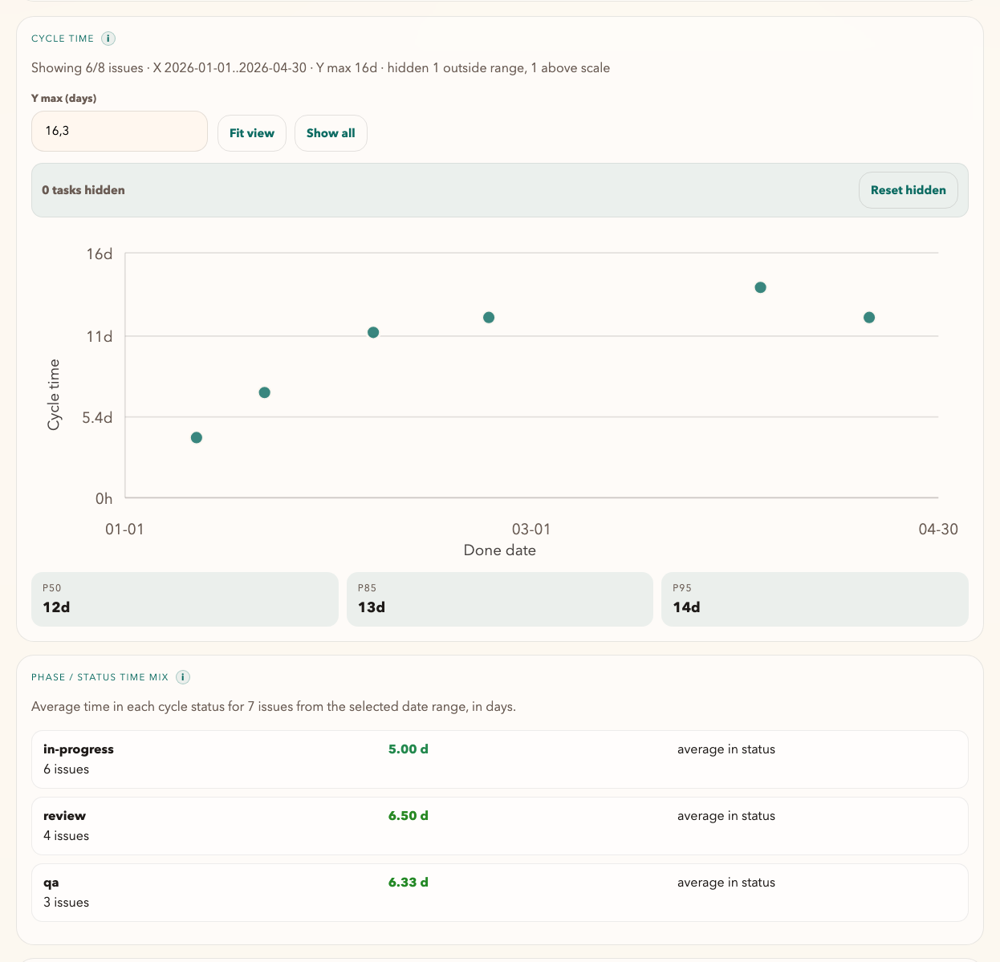
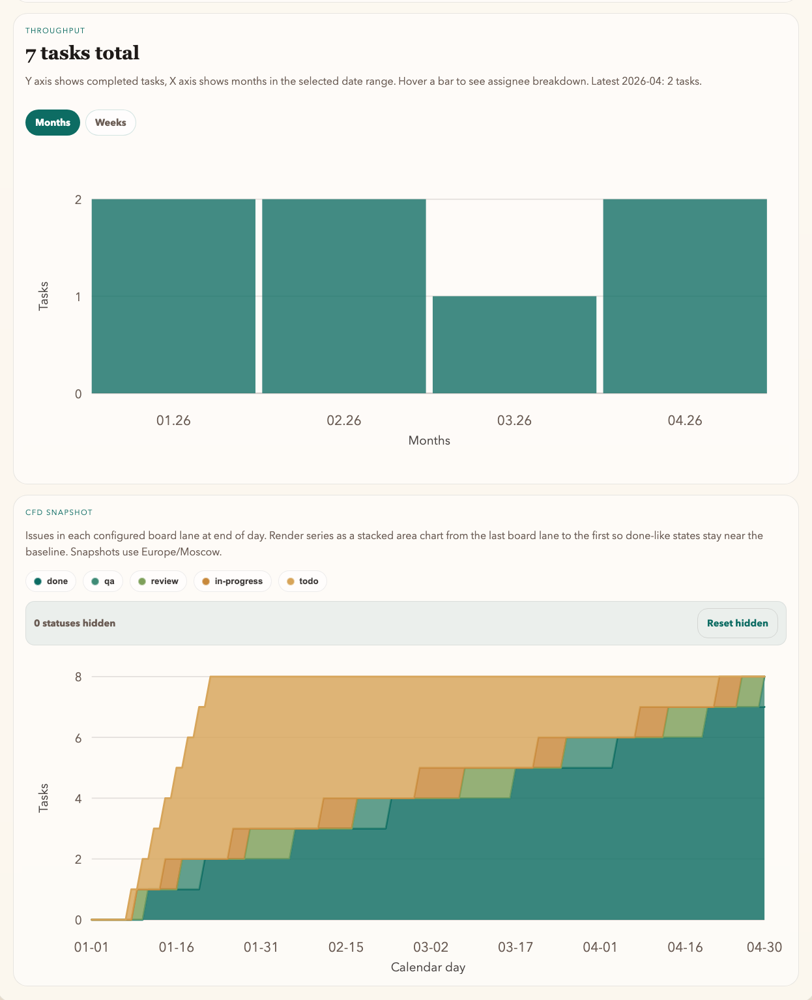

  

# Local-first Jira Kanban Analytics

A local-first Jira analytics app that syncs issue history into a local SQLite store and visualizes cycle time, throughput, phase ratio, and CFD without sending your project data to an external analytics backend.

## Project

- Local HTTP server + static dashboard UI
- Jira sync with persisted issue history and changelog events
- Native macOS wrapper for desktop use

## Wiki

- Implementation guide: [docs/github-wiki/Home.md](docs/github-wiki/Home.md)
- AI-friendly source map: [docs/IMPLEMENTATION_AI.md](docs/IMPLEMENTATION_AI.md)

## Screenshots

### Overview

### Cycle Time And Status Mix

### Throughput And CFD

